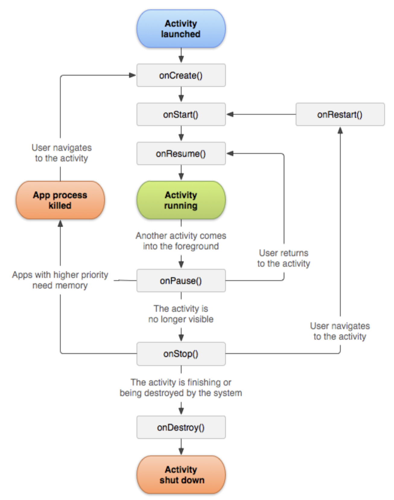

## 目录

- [安卓的四大组件](#安卓的四大组件)
- [生命周期](#生命周期)
- [安卓启动和执行过程](#安卓启动和执行过程)


## 安卓的四大组件

- **`Activity  活动`   : 一个Activity就是一个活动,可以进行界面显示和执行相应的逻辑任务.**
- **`BroadcastReceiver 广播接收者` : 对外部事件进行过滤 只对感兴趣的外部事件( 如电话呼入,或者数据网络可用时),  进行接收并做出响应.**
- **`Service 服务`   :  一个service 是一段长生命周期的, 没有用户界面的程序, 可以用来开发如监控类程序(执行权限比用户界面低)**
- **`ContentProvider`  : 使一个应用程序的指定数据集提供给其他应用程序 (也就是共享当前app的一些数据,让别的app可以访问)**


## 生命周期

> **生命周期:  app从开始到终止**


## 安卓启动和执行过程



**代码验证**

```java
package com.example.app03;

import androidx.appcompat.app.AppCompatActivity;

import android.os.Bundle;
import android.util.Log;
import android.view.View;
import android.widget.Button;
import android.widget.Toast;

public class MainActivity extends AppCompatActivity{

    // final 等同于 const , 不可修改变量,不可修改变量的指向  =  const char* const s;
    // 标志着, 这个日志是由 MainActivity 类打印的
    private static final String TAG = "MainActivity";

    //    @Override 关键字 代表 重写
    // 启动后第一个执行的方法
    @Override
    protected void onCreate(Bundle savedInstanceState) {
        super.onCreate(savedInstanceState);
        setContentView(R.layout.activity_main);
        // System.out.println("onCreate()");
        Log.i(TAG,"onCreate 执行了");
    }

    // 启动后第二个执行的方法, 会被onCreate() 和 onStop()调用
    // 程序从后台切换到前台时, 会再次被  onStop()调用
    @Override
    protected void onStart() {
        super.onStart();
        Log.i(TAG,"onStart 执行了");
    }

    // 启动后第三个执行的方法, onStart() 和 onPause()都会调用这个方法调用
    //  接着 他会调用  Activity running 去循环执行 app ,也就是常驻
    @Override
    protected void onResume() {
        super.onResume();
        Log.i(TAG,"onResume 执行了");
    }

    // app 被切换出去就会执行 , 放到后台, 暂停
    //  切换回来时, 会执行 onResume(),
    //     或者 优先级较高的应用需要内存 就会杀掉这个app ,进入 App process killed 状态
    @Override
    protected void onPause() {
        super.onPause();
        Log.i(TAG,"onPause 执行了");
    }

    // 程序切换后的第二个被执行的方法,  恢复时可以调用onRestart() 来跳转到 onStart() 来执行重启动作
    // 一般情况下 就是切换到了后台
    @Override
    protected void onStop() {
        super.onStop();
        Log.i(TAG,"onStop 执行了");
    }

    // app 重启动作, 他会跳转到 onStart() 去执行重启
    @Override
    protected void onRestart() {
        super.onRestart();
        Log.i(TAG,"onRestart 执行了");
    }

    // app 生命周期结束, 杀掉app
    @Override
    protected void onDestroy() {
        super.onDestroy();
        Log.i(TAG,"onDestroy 执行了");
    }
}
```


